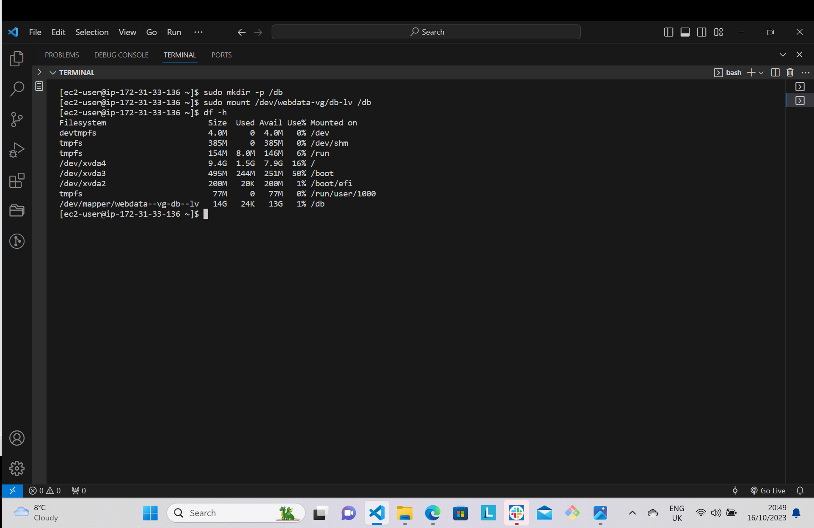
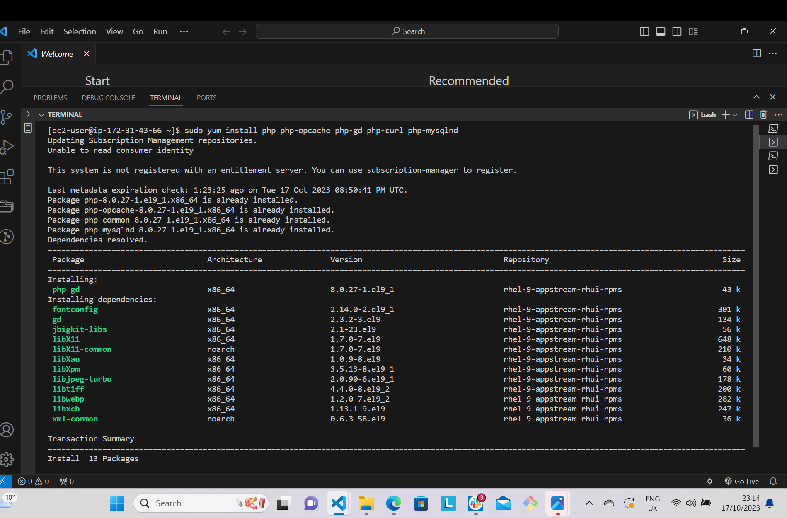
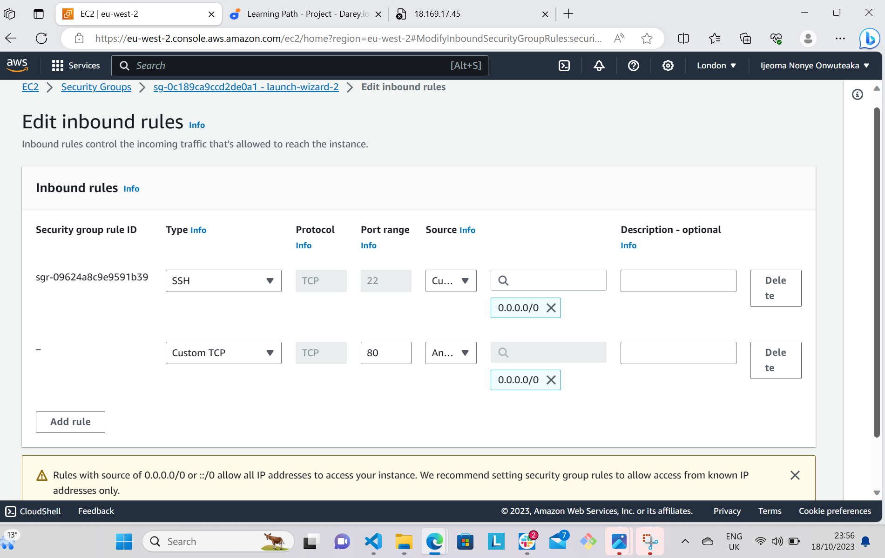

# IMPLEMENTING WORDPRESS WEBSITE WITH LVM STORAGE MANAGEMENT

## Prerequisites
For this project, you need to have your 3-Tier setup:
- A laptop or PC that will serve as a client.
- An EC2 Linux server as a web server (This is the server you'll install Wordpress) with RedHat as the AMI.
- An EC2 Linux server as a database (DB) server with RedHat as the AMI.

## Implementing LVM on Linux Servers (Web and Database servers)

**Step 1** - Prepare a Web Server

1. Go to your AWS and spin up an EC2 instance that will serve as "Web Server". 
2. Create 3 volumes in the same availability zone as your Web ServerEC2, each of 10 GIB. To do this follow these steps:

    - Go to your EC2 dashboard and click on volumes which is listed under Elastic Block Store.
    - Click on create volume
    - Change the size to 10 GIB and the availability zone to that of your EC2 instance.
    - Click on create volume.


3. Attach all the three volumes one at a time to your Web Server EC2 instance. Follow the below steps:

    - Select one volume
    - Right click on it and options will be displayed
    - Select attach volume
    - Select the Web Server instance 
    - Click attach
    - Repeat these steps for the subsequent volumes.

4. Connect your Web Server EC2 instance to your terminal through SSH.
To check which block devices are attached to the server, use the below command:
```python
'lsblk'
```


All devices in Linux are in /dev/directory. To inspect it and ensure that all three newly created block devices (which names might be `xvdf`, `xvdh`, `xvdg`) are there, use this command:

```python
'ls /dev/'
```


5. To see all mounts and free space on your server, run:

```python
'df -h'
```


6. Use gdisk utility to create single partition on each of the 3 disks. Type in this command:

```python
'sudo gdisk /dev/xvdf'
```


7. To view the newly configured partition on each 3 disks, run this command:

```python
'lsblk'
```


8. Install `lvwm2` package using this command:
```python
'sudo yum install lvm2'
```


9. Check for available partiotions using this command:

```python
'sudo lvmdiskscan'
```


10. To mark each of the 3 disks as physical volumes (PVs) to be used by LVM, use `pvcreate` utility by running the below command respectively:

```python
'sudo pvcreate /dev/xvdf1'
'sudo pvcreate /dev/xvdg1'
'sudo pvcreate /dev/xvdh1'
```

11. Verify that yoyr Physical volume has been created successfully by running:

```python
'sudo pvs'
```


12. Use `vgcreate` utility to add all 3 PVs to a volume group (VG) and call it *webdata-vg*. Type in the below command:

```python
'sudo vgcreate webdata-vg /dev/xvdh1 /dev/xvdg1 /dev/xvdf1'
```
13. To check your VG has been created successfully, run:

```python
'sudo vgs'
```


14. Create 2 logical volumes using `lvcreate` utility. Name them **apps-lv** (use half of the PV size) and **logs-lv**(use the remaining space of the PV size). apps-lv will be used to store data for the website while logs-lv will be used to staore data for logs. Type in the below command respectively:

```python
'sudo lvcreate -n apps-lv -L 14G webdata-vg'
'sudo lvcreate -n logs-lv -L 14G webdata-vg'
```
15. Verify that your logical volume has been created by running:

```python
'sudo lvs'
```


16. Verify the entire setup with this command:

```python
'sudo vgdisplay -v #view complete setup - VG, PV, and LV'
```


```python
'sudo lsblk'
```


17. Use the below command to format logical volumes wiith ext4 filesystem one at a time.

```python
'sudo mkfs -t ext4 /dev/webdata-vg/apps-lv'
'sudo mkfs -t ext4 /dev/webdata-vg/logs-lv'
```


18. Create */var/www/html* directory to store website files. Runthis command:

```python
'sudo mkdir -p /var/www/html'
```
19. Create */home/recovery/logs* to store backup of log data

```python
'sudo mkdir -p /home/recovery/logs'
```

20. Mount /var/www/html on apps-lv logical volume using this command:

```python
'sudo mount /dev/webdata-vg/apps-lv /var/www/html/'
```
21. To backup all the files in the log directory */var/log* into */home/recovery/logs* use `rsync` utility (This should be done before mounting the file system). Run:

```python
'sudo rsync -av /var/log/. /home/recovery/logs/'
```


22. Mount */var/log* on *logs-lv* logical volume, When this is done, all the existing data on *var/log* will and that's why step 21 above is very important.

```python
'sudo mount /dev/webdata-vg/logs-lv /var/log'
```
23. Restore log files back into */var/log*

```python
'sudo rsync -av /home/recovery/logs. /var/log'
```


24. Update `/etc/fstab` file so that the mount configuration will persist after restarting the server. The UUID of the device will be used to update the `etc/fstab` file: 

```python
'sudo blkid'
```


```python
'sudo vi /etc/fstab'
```

Update /etc/fstab in this format and use your own UUID.


25. Test the configuration and reload the daemon. Use thez

```python
'sudo mount -a'
'sudo systemctl daemon-reload'
```
26. To verify the setup, run: 

```python
'df -h'
```


**Step 2** - Prepare the Database Server

1. Launch a second RedHat EC2 instance that will serve as your Database Server.

2. Repeat the same steps as you did for the Web Server.

3. On step 14, instead of creating 2 logical volumes you will create one and name it `db-lv`.

```python
'sudo lvcreate -n db-lv -L 14G webdata-vg'
```
4. On step 18, create */db* directory instaed of */var/www/html*.

```python
'sudo mkdir -p /db'
```

5. Skip step 19

6. On step 20, mount *db-lv* to */db*

```python
'sudo mount /dev/webdata-vg/db-lv /db'
```


Skip step 21 to 23

On step 24, update the /etc/fstab file with your DB Server UUID.

```python
'sudo vi etc/fstab'
```


Follow the rest of the steps


**Step 3** - Install Wordpress on your Web Server EC2

1. Update the repository with this command:

```python
'sudo yum update -y'
```
2. Install wget, Apache (it is called httpd in RHEL) and it's dependencies by running:

```python
'sudo yum -y install wget httpd php php-mysqlnd php-fpm php-json'
```


3. Start Apache with these command:

```python
'sudo systemctl enable httpd'
'sudo systemctl start httpd'
```


4. Install PHP and it's dependcies with below commands one after the other:

```python
'sudo dnf install -y https://dl.fedoraproject.org/pub/epel/epel-release-latest-8.noarch.rpm'
'sudo yum install yum-utils http://rpms.remirepo.net/enterprise/remi-release-8.rpm'
'sudo yum module list php'
'sudo yum module reset php'
'sudo yum module enable php:remi-7.4'
'sudo yum install php php-opcache php-gd php-curl php-mysqlnd'
'sudo systemctl start php-fpm'
'sudo systemctl enable php-fpm'
'sudo setsebool -P httpd_execmem 1'
```




5. Restart Apache by running this command:

```python
'sudo systemctl restart httpd'
```
6. Download wordpress and copy it to */var/www/html*. Run the below commands one after another:

```python
'mkdir wordpress'
'cd   wordpress'
'sudo wget http://wordpress.org/latest.tar.gz'
'sudo tar xzvf latest.tar.gz'
'sudo rm -rf latest.tar.gz'
'sudo cp wordpress/wp-config-sample.php wordpress/wp-config.php'
'sudo cp -R wordpress /var/www/html/'
```


7. Configure SELinux policies, run the below command one at a time:

 ```python
 'sudo chown -R apache:apache /var/www/html/wordpress'
 'sudo chcon -t httpd_sys_rw_content_t /var/www/html/wordpress -R'
 'sudo setsebool -P httpd_can_network_connect=1'
 ```


**Step 4** - Install MySQL on your DB Server EC2

1. Update the repsitory:

```python
'sudo yum update -y'
```

2. Install mysql:

```python
'sudo yum install mysql-server -y'
```


3. Verify the service is running:

```python
'sudo systemctl status mysqld'
```
4. Restart the service and enable it so it will be running after rebooting it:

```python
'sudo systemctl restart mysqld'
'sudo systemctl enable mysqld'
```


**Step 5** - Configure DB to work with WordPress

To do this, run the below command step by step:

```python
'sudo mysql'
'CREATE DATABASE wordpress;'
'CREATE USER `myuser`@`<Web-Server-Private-IP-Address>` IDENTIFIED BY 'mypass';'
'GRANT ALL ON wordpress.* TO 'myuser'@'<Web-Server-Private-IP-Address>';'
'FLUSH PRIVILEGES;'
'SHOW DATABASES;'
'exit'
```


Now go back to your Web Sever EC2 instance and configure the *wp-config.php* file. Run the below command one after another:

```python
'cd /var/www/html'
'sudo vi wp-config.php'
```
Type in your database user details you created. See the below image.


**Step 6** - Configure WordPress to connect to remote database

Go to your DB Server and open MySQL port 3306. Allow access to the DB Server only from your Web Server's IP address


1. Install MYSQL client and test that you connect from your Web Server to your DB Server by using `mysql-client`

```python
'sudo yum install mysql -y'
```
```python
'sudo mysql -u admin -p -h <DB-Server-Private-IP-address>'
```

2. Verify if you can successfully execute by typing this command:

SHOW DATABAES;


3. Change permissions and configuration so Apache could use Wordpress. Run the below command:

```python
'sudo chown -R apache:apache /var/www/html/wordpress'
'sudo chcon -t httpd_sys_rw_content_t /var/www/html/wordpress -R'
'sudo setsebool -P httpd_can_network_connect=1'
```


4. Go to your Web Server EC2 instance, open port 80 in inbound rules and allow traffic from anywhere.



Open your web browser and paste your Web Server link on it `http://<Web-Server-Public-IP-Address>/wordpress`


Click continue and fill in your database user details as you created it prviously and submit.


Login page will come up, login your details.


You see a page like in below image


You have successfully connected your Wordpress to your remote MySQL database.